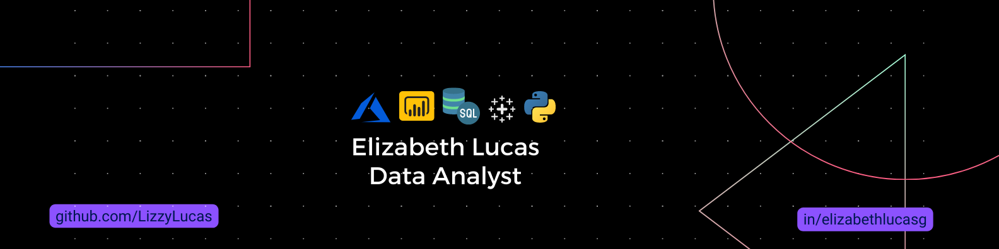

<div id="header" align="center"> 
  <h1>  :space_invader: print("Hi, devs! I'm <a href="https://www.linkedin.com/in/elizabethlucasgarcia/">Lizzie Lucas </a>):v:
</div>

<div align="center">
  <a href="https://www.linkedin.com/in/elizabethlucasgarcia/" target="_blank"></a> 
  <a href="mailto:lizzielucas.g@gmail.com"></a>
  <a href="https://www.instagram.com/lizzielucas_g/" target="_blank"></a>   
  <a href="https://twitter.com/lizzielucas_g"></a>
</div>

<div align ="center">

:trident:I’m currently learning **data science**, 🔭 I’m working on **thesis and on this portfolio** & :bar_chart: I’m looking to collaborate on **data processing and analysis projects**.

</div>

* ** **

<div>
  <h2>A little about me.</h2>
  <p align="left"><b>
   :pushpin: Jr Data Analyst<br>
   :pushpin: Computer Systems Engineer<br>
   :pushpin: Beta Milestone <a href="https://github.com/MLSA-LATAM"> MLSA </a><br>
   :pushpin: Co-founder <a href="https://github.com/orgs/x-women-mx/teams/founders"> X-Women </a><br>
   :pushpin: Ambassador of Tecnolochicas MX<br>
   :pushpin: Hackathonera<br>
  </b></p>
</div>

* ** **

<div>
  <h2>My background.</h2> 
<div</>

<div align="center" valign="top"><br>
  <a href="https://www.microsoft.com/es-mx/sql-server/" target="_blank" rel="noreferrer">
    
  </a>  
  <a href="https://www.mysql.com/" target="_blank" rel="noreferrer"> 
   
  </a>  
  <a href="https://powerbi.microsoft.com/es-mx/" target="_blank" rel="noreferrer">
    
  </a>  
  <a href="https://www.tableau.com/" target="_blank" rel="noreferrer">
    
  </a>
  <a href="https://www.python.org/" target="_blank" rel="noreferrer">
    
  </a> 
   <a href="https://www.rstudio.com/" target="_blank" rel="noreferrer">
    
  </a>  
  <a href="https://docs.microsoft.com/en-us/dotnet/csharp/programming-guide/" target="_blank" rel="noreferrer">
    
  </a>  
    <a href="https://jupyter.org/" target="_blank" rel="noreferrer">
    
  </a>
  <a href="https://www.w3.org/html/" target="_blank" rel="noreferrer">
    
  </a>  
  <a href="https://www.w3schools.com/css/" target="_blank" rel="noreferrer">
    
  </a> 
  <a href="https://azure.microsoft.com/en-in/" target="_blank" rel="noreferrer">
    
  </a>
  <a href="https://cloud.google.com/" target="_blank" rel="noreferrer">
    
  </a>   
   <a href="https://git-scm.com/" target="_blank" rel="noreferrer">
    
  </a>  
  <a href="https://github.com/" target="_blank" rel="noreferrer">
    
  </a>  
  <a href="https://www.microsoft.com/es-mx/microsoft-365/excel" target="_blank" rel="noreferrer">
    
  </a>  
</div><br>

```javascript
const Lizzie = {  
  databases: ['SQL Server', 'MySQL'],
  data: ['SSIS','ETLs','KPIs'],
  visualization: ['PowerBI', 'Tableu'],
  code: ['Python','C#', 'R', 'Java', 'HTML', 'CSS', 'Javascript'],
  tools: ['Jupyter','Power Pivot', 'Excel', 'DB management'],
  cloud: ['Azure','GCP']
}
```
* ** **
<h3> My GitHub Stats </h3>
<div align ="center">
  <a href="https://github.com/lizzylucas">
    
    
  </a>
</div>

* ** **

<div>
 <em><b> "Be the (data-savvy) change you want to see in the world"</b> </em>
</div>

