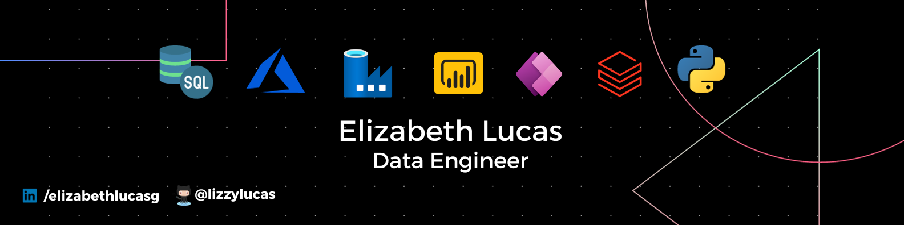

  


<div id="header" align="center"> 
  <h1>  :space_invader: print("Hi, datalovers! I'm <a href="https://www.linkedin.com/in/elizabethlucasg/">Lizzie Lucas</a>"):v:
</div>

<div align ="center">

🔭I am a **data engineer** who loves to **explore, analyze and visualize data.** :bar_chart:
 
I am passionate about creating innovative and efficient solutions to complex problems using tools such as _Python, SQL, ADF, Databricks and Azure_. I also like to share my knowledge and experiences with other people, especially **women who want to enter the STEM field.** For this reason, I actively participate in **technological communities** where I give workshops and mentoring on topics related to data. **My goal** is to continue learning and growing as a professional and as a person, and contribute to the development of data engineering in the world. :trident:
</div>

* ** **

<div>
  <h2>A little about me.</h2>
  <p align="left"><b>
   :pushpin: Data Engineer<br>
   :pushpin: Computer Systems Engineer<br>
   :pushpin: Co-founder <a href="https://github.com/orgs/x-women-mx/teams/founders"> X-Women community</a><br>
   :pushpin: Hackathonera<br>
  </b></p>
</div>

* ** **

<div>
  <h2>My background.</h2> 
<div</>


  
<div align="center" valign="top"><br>

  <a href="https://azure.microsoft.com/en-in/" target="_blank" rel="noreferrer">
    
  </a>
  <a href="https://www.databricks.com/" target="_blank" rel="noreferrer">
    
  </a>
  <a href="https://www.microsoft.com/es-mx/sql-server/" target="_blank" rel="noreferrer">
    
  </a>  
  <a href="https://adf.azure.com" target="_blank" rel="noreferrer">
    
  </a>
  <a href="https://www.python.org/" target="_blank" rel="noreferrer">
    
  </a>     
  <a href="https://powerapps.microsoft.com/" target="_blank" rel="noreferrer">
    
  </a>
    <a href="https://powerbi.microsoft.com/es-mx/" target="_blank" rel="noreferrer">
    
  </a>
  <a href="https://github.com/" target="_blank" rel="noreferrer">
    
  </a>  
  <a href="https://www.microsoft.com/es-mx/microsoft-365/excel" target="_blank" rel="noreferrer">
    
  </a>  
    
</div><br>

```javascript
const Lizzie = {  
  databases: ['Azure SQL Server', 'Synapse', 'Autonomous'],
  data: ['ETL','KPI', 'DB management','pipelines'],
  bi: ['Power BI', 'Power Apps'],
  code: ['Python','Databricks', 'Spark', 'JSON'],
  cloud: ['Azure','GCP', 'OCI'],
  tools: ['Jupyter','Azure Data Studio', 'Excel'],
  certifications: ['DP-900','PL-900', 'AZ-900', 'SFC' 'Databricks Lakehouse Fundamentals']
}
```
* ** **

<h3> My GitHub Stats </h3>

<div align ="center">
  <a href="https://github.com/lizzylucas">
    
    
    
  </a>
</div>

* ** **
<h2> Connect with me.</h2>
   <div>
      
   </div>
   
   <div>
    <a href="https://www.linkedin.com/in/elizabethlucasg/" target="_blank">
    </a> 
    <a href="mailto:lizzielucas.g@gmail.com"></a>
    <a href="https://www.instagram.com/lizzielucas_g/" target="_blank">
    </a>   
    <a href="https://twitter.com/lizzielucas_g">
    </a>
   </div>
   
   <div>
     <em><b> "Be the (data-savvy) change you want to see in the world." </b></em>
   </div>
   
  

